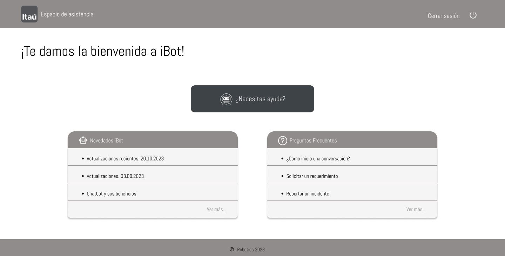

# IBOT

## Índice

* [1. Preámbulo](#1-preámbulo)
* [2. Resumen del proyecto](#2-resumen-del-proyecto)
* [3. Historias de Usuarios](#3-historias-de-usuarios)
* [4. Prototipo Baja Fidelidad](#4-Prototipo-Baja-Fidelidad)
* [5. Prototipo Alta Fidelidad](#4-Prototipo-Alta-Fidelidad)
* [4. Producto Final](#4-Producto-Final)

## 1. Preámbulo
La plataforma de Gestión de Requerimientos del Banco Itaú abarca tanto aplicativos web como robots. En la actualidad, existen tres categorías principales de requerimientos en el área de Robotics, que incluyen RPA/Robot, Software/WorkFlow/BBDD y Soporte TI Robotic. Cada una de estas categorías cuenta con diversos tipos de requerimientos y solicitudes. El objetivo de este proyecto consistió en desarrollar un prototipo de asistente virtual, diseñado para facilitar la solicitud de requerimientos por parte de los usuarios o la notificación de incidentes relacionados con la plataforma de RPA del Banco. Este asistente se destaca por su capacidad para entender y procesar en lenguaje natural.

## 2. Resumen del proyecto
Desarrollo del proyecto IBOT, el cual   es  un asistente virtual que orienta al usuario en la solicitud de requerimientos y reporte de incidentes en la plataforma RPA del Banco.

## 3. Historias de Usuarios

H1. Yo como Ituber quiero iniciar sesion en el IBot con mi email y contraseña.      
H2. Yo como Ituber quiero poder ingresar el código de verificación para validar ingreso con mi clave y usuario.  
H3. Yo como Ituber quiero tener un espacio de bienvenida con novedades de ItauBerAsistant, preguntas frecuentes sobre su uso y un boton para ingresar en él.  
H4. Yo como Ituber quiero interactuar con iBot para poder levantar un requerimiento o reportar un incidente.  
H5. Yo como ituber quero obtener un número de ticket de la solicitud creada.  

## 4.Prototipo Baja Fidelidad

    

    

    

    

    

    

      

## 5.Prototipo Alta Fidelidad  

    

    

    

    

    

    

    

    

    

    

## 6. Producto final  

    

    

    

    

    
